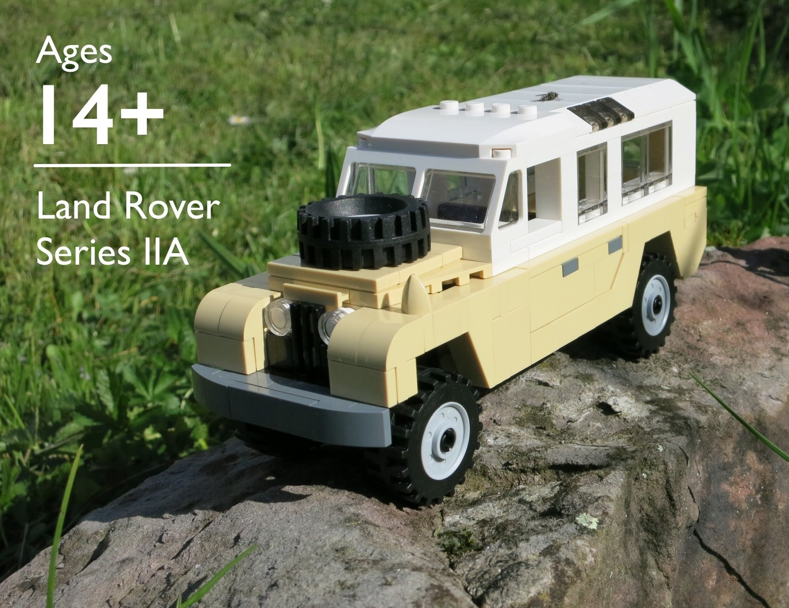

# LEGO Land Rover Series IIA

## Land Rover Type
This is a LEGO MOC[1] of an early [Series IIA Land Rover](https://en.wikipedia.org/wiki/Land_Rover_Series#Series_IIA)[2] (ca. 1965).

## How To Use
This project contains different files which allow you to either just build the model, or to use the source file of the 3D CAD model to modify it to your liking.

### Source File

If you would like to play around with the model, modify it, or use it as a basis for other LEGO creations, you can use the 3D model of the set, which is provided in [LDraw](http://www.ldraw.org/)[3] format. LDraw is an open standard and there are a number of free CAD tools available on different platforms which allow you to work with the file.

### Building Instructions

The building instructions are provided as a step-by-step guide, much like you are used to from official LEGO sets. 
You can download the [Instructions in PDF format](Land-Rover-Series-IIA.pdf). You should be able to use any PDF Viewer to open it (the viewer built into the Google Chrome browser also works).

## Parts Lists

The parts list is provided in different formats for various LEGO community and commerce sites. The parts lists were all created using the [Rebrickable](http://rebrickable.com/)[4] export function. This should allow you to upload the lists to sites where you can try to source the needed parts from (I recommend [Bricklink](http://www.bricklink.com/)[5] for this.

## Acknowledgements

This model is based on the [Land Rover Defender MOC](http://rebrickable.com/mocs/Zagdima/land-rover-defender)[6] which was published on Rebrickable by [Zagdima](http://rebrickable.com/designer/Zagdima).
Zagdima credits Lichtblau[7] for the [original model design of the Defender MOC](https://www.flickr.com/photos/42874449@N08/4212812705)[8]

Zagdima's model was provided as [Lego Digital Designer (LDD)](http://ldd.lego.com/)[9] file, and I used the LDD to modify the model and transform it to the older Series IIA Land Rover. The whole chassis section is still the same, but I made substantial changed in the front and rear of the car, as well as some details which were more characteristic of the older model. 

In order to produce better building instructions, I moved the project from LDD to the LPub format. I used MLCad 3.5, which is part of the [LDraw Windows All-In-One-Installer](http://www.ldraw.org/article/104.html)[10]. 

The instructions were rendered using [LPub 3D](https://sourceforge.net/projects/lpub3d/)[11] by [Trevor Sandy](https://sourceforge.net/u/trevorsandy/profile/).

The cover picture was taken from a real life build of the model in my own garden. (I swear I didn't notice the fly on the roof until much later!)

## Glossary/References

[1] MOC: My Own Creation  
[2] Series IIA Land Rover Wiki (https://en.wikipedia.org/wiki/Land_Rover_Series#Series_IIA)  
[3] LDraw: (http://www.ldraw.org/)  
[4] Rebrickable: (http://rebrickable.com/)  
[5] Bricklink: (http://www.bricklink.com)  
[6] Land Rover Defender MOC by Zagdima: (http://rebrickable.com/mocs/Zagdima/land-rover-defender)  
[7] Flicker Page of Lichtblau: (https://www.flickr.com/photos/42874449@N08)  
[8] Original Defender MOC by Lichtblau: (https://www.flickr.com/photos/42874449@N08/4212812705)  
[9] Lego Digital Designer (LDD): (http://ldd.lego.com/)  
[10] LDraw Windows All-In-One-Installer: (http://www.ldraw.org/article/104.html)  
[11] LPub 3D: (https://sourceforge.net/projects/lpub3d/)  

